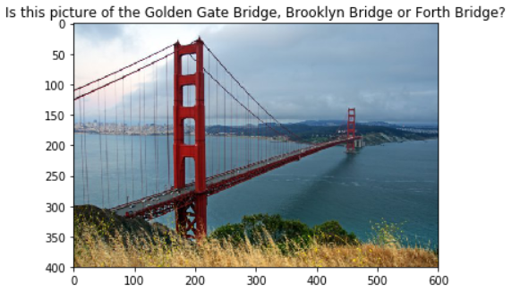

### Table of Contents

1. [Project Overview](#overview)
2. [Installation](#installation)
3. [Instructions](#instructions)
4. [Dataset](#dataset)
5. [Acknowledgment](#acknowledgment)

## Project Overview <a name="overview"></a>

The goal of this project is to build models to automatically predict the location of the image based on any landmarks represented in it. At the end, the code accepts any user-supplied image as input and will suggest the top *k* most relevant landmarks out of 50 possible landmarks from around the world. The image below displays sample output.



Using Convolutional Neural Networks (CNNs), two models were trained: from scratch and using transfer learning (InceptionV3). The augmentation and normalization steps are described in the notebook, as well as the architecture of the models.

## Installation <a name="installation"></a>

For development, the following dependencies were used:

- cv2
- numpy
- matplotlib
- PIL
- torch
- torchvision

## Instructions <a name="instructions"></a>

1. Clone the repository and navigate to the downloaded folder.
	```	
	https://github.com/gustaph/landmark-classification.git
	cd nd101-c2-landmarks-starter/landmark_project
	```
2. Download the dataset included below in the [Dataset section](#dataset).
3. Open the notebook and run the cells.
	```
	jupyter notebook landmark.ipynb
	```
## Dataset <a name="dataset"></a>

The landmark images are a subset of the Google Landmarks Dataset v2. It can be obtained using [this link](https://udacity-dlnfd.s3-us-west-1.amazonaws.com/datasets/landmark_images.zip).

You can find license information for the full dataset [on Kaggle](https://www.kaggle.com/google/google-landmarks-dataset).

## Acknowledgment <a name="acknowledgment"></a>

Must give credit to [**Udacity**](https://www.udacity.com)
